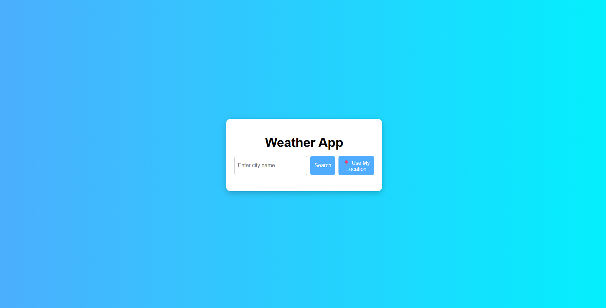
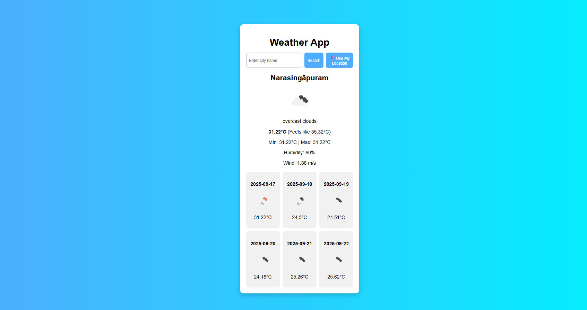

Weatherforecast

A modern, responsive weather forecasting web application that provides real-time weather information for any city worldwide.

Live Demo: https://wfcs.netlify.app/

**Overview:**

Weatherforecast is a simple yet powerful web application that allows users to fetch weather details for any city, including temperature, humidity, wind speed, and a multi-day forecast. It leverages the OpenWeatherMap API to provide accurate and up-to-date weather data, wrapped in a clean and intuitive user interface.

**Features:**

-> Search weather by city name
-> Current weather conditions display
-> Multi-day weather forecast
-> Responsive design for desktop and mobile
-> Clean and user-friendly interface

**Technologies:**

Frontend: HTML, CSS, JavaScript
API: OpenWeatherMap API

**Follow these steps to run the project locally:**

*Clone the repository:*

git clone https://github.com/Ksnehareddys/Weatherforecast.git
cd Weatherforecast

Open index.html:
Open the index.html file in your browser to launch the app.

*Usage-*
Enter the city name in the search bar.
Press Enter or click the search button.
View the current weather and forecast details displayed on the page.

Project Structure
Weatherforecast/
├── index.html       # Main HTML page
├── style.css        # Styling for the application
├── script.js        # JavaScript logic and API calls
└── README.md        # Project documentation

